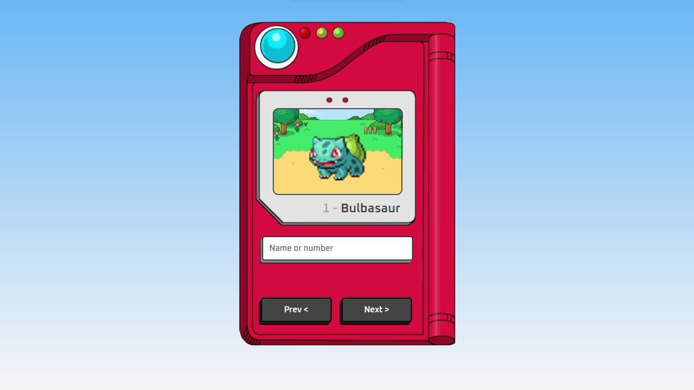

  

  

  

  

  

## 💻 Projeto

Pokédex simples que mostra foto, id e nome do pokémon escolhido pelo usuário. Desenvolvido com HTML, CSS e JavaScript utilizando a [PokéAPI](https://pokeapi.co/).

## ✨ Tecnologias e features

- [x] HTML
- [x] CSS
- [x] JavaScript Assíncrono
- [x] [PokéAPI](https://pokeapi.co/)

## 📄 Licença

Esse projeto está sob a licença MIT. Veja o arquivo [LICENSE](.github/LICENSE.md) para mais detalhes.
